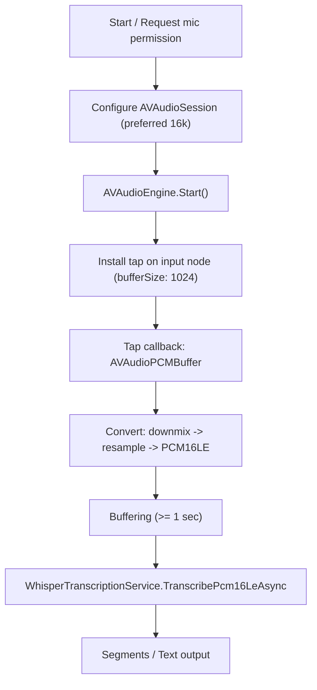

# WhisperSample

マイク入力を一定間隔で Whisper に渡して、結果テキストを画面に追記表示する最小実装。

- MVVMなし（コードビハインド直結）
- 未確定/確定の判定なし

## 前提

- `Models/ggml-small.bin` がダウンロード済であること
> 注: リポジトリによってはモデルをGit管理しないため、未配置でもビルドが通るようにしてある

## 実装の要点

- 音声入力: `Services/Audio/AudioStreamSource.ios.cs`
- 推論: `Services/Whisper/WhisperTranscriptionService.cs`
- ストリーミング制御: `Services/RealtimeTranscriber.cs`
- UI: `MainPage.xaml` / `MainPage.xaml.cs`

## 注意

- iOS のマイク許可が必要（初回起動時に許可ダイアログが出る）。
  - `Info.plist` に `NSMicrophoneUsageDescription` があること
  - 設定アプリで WhisperSample のマイクが拒否になっていないこと

## AVAudioSession の `setPreferredSampleRate()` について

- `AVAudioSession.setPreferredSampleRate(16000)` は **あくまで希望値を提示するだけ**であり、AirPods やライトニング接続イヤホンなど多くのデバイスでは 24 kHz や 48 kHz が固定されているため、設定値がそのまま適用されないことがある。先行事例でも、録音時に実際のサンプルレートを `GetBusOutputFormat` などで取得し、それに基づいて後段で変換する方法が採られている。

- 実際のハードウェアが 16 kHz をサポートしている場合はそのまま利用できるが、**サンプルレートが異なる場合は AVAudioConverter によるリサンプリングが不可欠**である。利用しているデバイスに依存せずに16 kHzに統一するため、preferred値を設定しても必ず変換処理を設けるべきというのが定番である。

## AVAudioConverter の使い方と注意点

- 先行事例では **`AVAudioConverter` を使ってダウンミックス（ステレオ→モノラル）とリサンプリングを 2 段階で行う**。マイクの入力がすでに16 kHz/モノラル/Float32 の場合は変換を省略し、それ以外はまずモノラル Float32 に変換し、その後に 16 kHz Float32 へリサンプリングする。

- `AVAudioConverter` を用いたリアルタイム変換では、**`primeMethod = .none` を指定**し、`inputBlock` では初回呼び出しだけ音声バッファを返し、2 回目以降は `.NoDataNow` を返すことが推奨されている。Stack Overflow 等でも、このパターンでないと同じバッファが繰り返し供給されて音声がループする（`ABCABC...` と繰り返される）という報告がある。

- Apple の解説では convenience API（`convert(to:from:inputBlock:)`）を不用意に使うとポップノイズや途切れが発生することがあり、**内部状態を持たせたまま使い回さず、バッファ単位で新しいコンバータを作る**やり方が紹介されている。

## 音声フレームの蓄積と Whisper への入力

- Whisper（特に `whisper.cpp`／`whisper.net`）は 16 kHz モノラル PCM の入力を前提としており、**少なくとも 1 秒間（16 000 サンプル）程度の音声**を入力しないと推論が行われない実装が多い。現在の `WhisperTranscriptionService` では `samples.Length < 16000` の場合に空文字を返す構造になっている。

## 音声キャプチャから文字起こしまでの処理フロー
### オーディオキャプチャと変換

1. **マイク権限とオーディオセッションの設定**  
   - `AudioStreamSource` で `AVAudioSession.RecordPermission` を確認し、必要であれば `RequestRecordPermission` を呼び出してユーザにマイク使用を許可してもらいます。  
   - `AVAudioSession.SetCategory(.PlayAndRecord)` で録音・再生カテゴリを指定し、`SetPreferredSampleRate(16000)` で 16 kHz を希望します。しかし AirPods は 24 kHz、Lightning 接続イヤフォンは 48 kHz などハードウェアごとにサンプルレートが固定されており、希望が必ずしも適用されるわけではありません【315485200129668†L18-L24】。そのため後段でサンプルレート変換が必要になります。

2. **オーディオエンジンの起動とタップ**  
   - `AVAudioEngine` の `InputNode` に 1024 フレームのタップを設置し、マイクからの PCM バッファを定期的に受け取ります。  
   - 受け取ったバッファは `ConvertTo16kMonoPcm16Le` に渡され、以下の処理を行います。
     1. **モノラル化と Float32 化**: 入力がステレオや Int16 の場合は `AVAudioConverter` を用いてモノラルの `PCMFloat32` に変換します。この際 `primeMethod = .none` を指定し、`inputBlock` でバッファを1回だけ提供した後は `.NoDataNow` を返すパターンにします【294081126538626†L170-L178】。
     2. **16 kHz へのリサンプリング**: 続けて別の `AVAudioConverter` で 16 kHz モノラル `PCMFloat32` へリサンプリングします。ハードウェアが 24 kHz や 48 kHz でもこの処理により 16 kHz に統一できます。
     3. **Float32 → Int16 変換**: 最終的に `PCMFloat32` の値を `[-1.0, +1.0]` にクリップし、`short.MaxValue` との積で Int16 に変換してリトルエンディアン配列にします。
   - 変換後の 16 kHz/モノラル PCM16 データは `PcmChunk` イベントで `(byte[] data, int bytes, int sampleRate, short channels)` として通知されます。

### バッファリングと音声認識

1. **PCM バッファの蓄積** (`RealtimeTranscriber`)  
   - `PcmChunk` のたびにバイト配列をリストに追記し、最大40秒分（約 1.28 MByte）まで保持します。  
   - 定められた間隔 (`interval` ミリ秒) ごとにスナップショットを作成し、長さが 2 秒未満の場合はスキップします。

2. **Whisper での文字起こし** (`WhisperTranscriptionService`)  
   - スナップショットを 16 kHz/モノラル/PCM16 と仮定し、長さが 1 秒 (16000 サンプル) 未満なら空文字列を返します。  
   - PCM16 配列を 1/32768.0f のスケールで Float32 配列に変換し、`WhisperProcessor.ProcessAsync` へ渡してストリーミング推論を行います。  
   - 推論で得られた各セグメントのテキストを連結し、非空なら `yield` してバッファをクリアします。

### 処理の流れ

## 参考文献
https://developer.apple.com/library/archive/documentation/MusicAudio/Conceptual/AudioUnitHostingGuide_iOS/AudioUnitHostingFundamentals/AudioUnitHostingFundamentals.html#:~:text=doing%20so%20by%20way%20of,the%20sample%20code%20project%20aurioTouch

https://community.openai.com/t/audio-notes-for-openai-realtime-on-apple-platforms/1108404

https://maysamsh.me/2022/07/11/record-and-resample-audio-with-audio-engine/#:~:text=The%20last%20function%20in%20the,function

https://medium.com/@jonataneduard/building-a-real-time-on-device-speech-to-text-in-swiftui-with-whisper-core-ml-ios-17-b1d468e44f4d

https://www.createwithswift.com/implementing-advanced-speech-to-text-in-your-swiftui-app/#:~:text=var%20bufferProcessed%20%3D%20false
